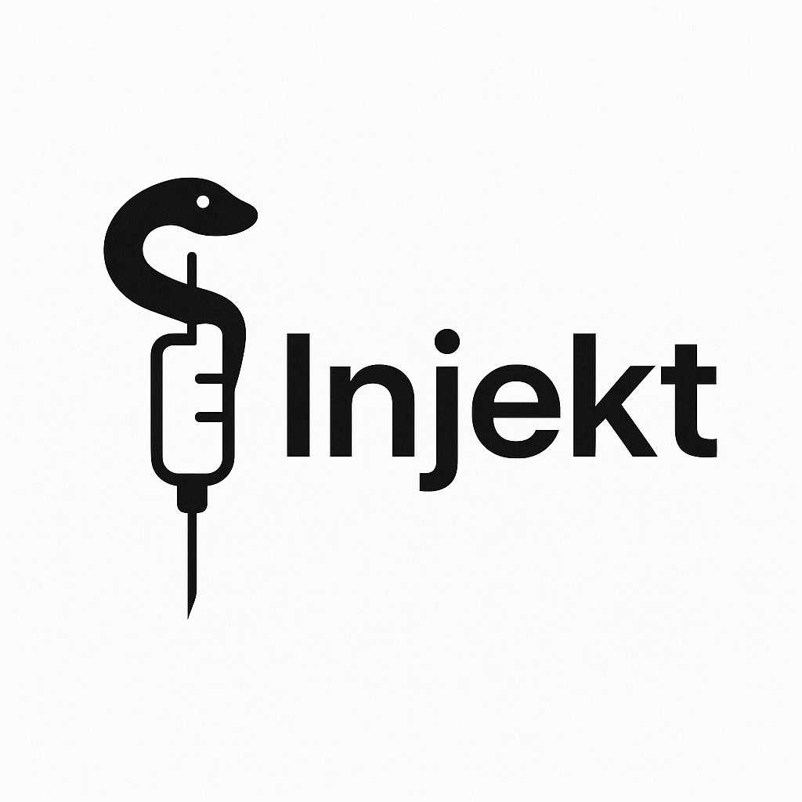

# Injekt: Lightweight Dependency Injection Library for Python



## Overview

This project is a lightweight and easy-to-use Dependency Injection (DI) library for Python, designed to simplify the
process of managing dependencies in your application. The library provides an intuitive and powerful way to handle
dependencies, promoting better code organization, improved testability, and a clean separation of concerns.

## Features

- **Lightweight and Fast**: Minimal overhead while providing essential DI functionality.
- **Easy to Use**: Simple and intuitive API for managing dependencies.
- **Flexible**: Supports injection of both classes and simple objects.
- **Test Friendly**: Simplifies mocking dependencies for testing purposes.
- **No Third-Party Dependencies**: Fully self-contained implementation without relying on external packages.

## Installation

To install the library, use the following command:

```bash
pip install injekt
```

(Note: Replace `<library-name>` with the actual name of the library when published to PyPI.)

## Getting Started
TODO

## Contributing

Contributions are welcome! If you'd like to contribute to the development of this library:

1. Fork the repository.
2. Create a feature branch: `git checkout -b feature-name`.
3. Commit your changes: `git commit -m "Description of the feature"`.
4. Push to the branch: `git push origin feature-name`.
5. Open a Pull Request.

## License

This project is released under the [MIT License](LICENSE). Feel free to use it in your own projects!

---

Thank you for using this Dependency Injection library. Happy coding!